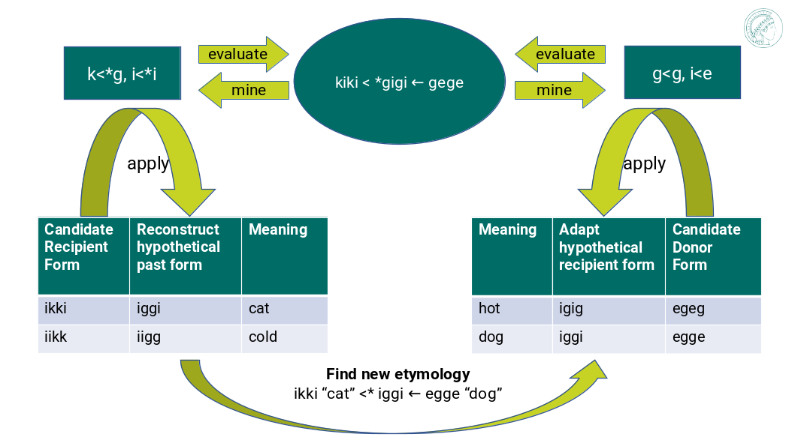

Tutorial
========

This tutorial will walk you through the process of using loanpy to
discover old loanwords.

Here is an illustration of the loanword detection framework with a minimal
example:

         saying "kiki < gigi ← gege". Two arrows point away and towards it
         both on its left and on its right. The ones pointing away say "mine",
         and the ones pointing towards it "evaluate". The ones pointing
         away point towards a green box each. The box on the left reads
         "k<g, i<i" and the box on the right "g<g, i<e". There are two
         bigger turquoise 3x3-tables underneath the green boxes. The one on the
         left looks like this: The left column
         reads "Candidate Recipient Form, ikki, iikk", the middle column
         "Reconstruct hypothetical past form, iggi, iigg", and the right
         "Meaning, cat, cold". There's a yellow curved arrow
         above it, going from the left column up towards the green box and
         bending down and pointing to the second column. It says "apply" in
         the middle of its arch. The other 3x3 table is a mirrored version of
         this. Its left column reads "Meaning, hot, dog", its middle one
         "Adapt hypothetical recipient form, igig, iggi" and its right
         "Candidate Donor Form, egeg, egge". The yellow-apply arrow points
         from the right column to the middle one. There is a big yellow curved
         arrow on the bottom too, pointing from the middle column of the left
         3x3 table, to the middle column of the right 3x3 table. Above its
         arch it says "Find new etymology: ikki “cat” < iggi ← egge “dog”"

   The loanword detection framework with a minimal example: Mine sound
   correspondences from an etymological dictionary, evaluate their predictive
   power, input them to a sound change applier to generate pseudo-adapted and
   pseudo-proto-forms, and search for phono-semantic matches between those
   predictions.

Step 1: Mine sound correspondences
----------------------------------

Grab an etymological dictionary and mine information of how sounds
and phonotactic patterns changed during horizontal and vertical transfers.

In the minimal example, our dictionary contains only one etymology, namely
a horizontal transfer "gigi ← gege" and a vertical one "kiki < gigi".
If we mine the sound correspondences we get the rule "g from g, i from e"
in horizontal transfers and "k from g, i from i" in vertical ones.
In terms of phonotactics, we can mine "CVCV from CVCV" both horizontally
and vertically.

For an implementation with a detailed guide visit `Part 3 (steps 1-4) of
ronataswestoldturkic's documentation
<https://ronataswestoldturkic.readthedocs.io/en/latest/mkloanpy.html>`_.

Step 2: Apply sound correspondences
-----------------------------------

Take the information mined from the etymological dictionary
and apply it to unseen words.
Create hypothetical proto- and adapted forms by simulating their horizontal
and vertical changes.

In the minimal example this means predicting that <ikki> must go back to
<iggi> and <iikk> to <iigg>, based on the mined sound correspondences for
vertical transfers. Likewise, <egeg> must turn into <igig> and <egge> into
<iggi> during horizontal transfers, based on the extracted sound
correspondences.

For an implementation with a detailed guide to predict vertical transfers visit
`gerstnerhungarian's documentation
<https://gerstnerhungarian.readthedocs.io/en/latest/?badge=latest>`_ and for
predicting horizontal transfers (loanwords) visit
`koeblergothic's documentation
<https://koeblergothic.readthedocs.io/en/latest/?badge=latest>`_.

Step 3: Evaluate sound correspondences
--------------------------------------

How good are the predictions made from the mined sound correspondences?

Our minimal example is a perfect model: It would accurately predict with
100 percent certainty that <kiki> goes back from <gigi> and that the
donor form of <gigi> must have been <gege>.

For an implementation with a detailed guide
employing concepts from statistics such as `leave-one out cross-validation
(LOOCV)
<https://en.wikipedia.org/wiki/Cross-validation_(statistics)#Leave-one-out_cross-validation>`_,
the `receiver operating characteristics (ROC) -curve
<https://en.wikipedia.org/wiki/Receiver_operating_characteristic>`_,
and the `area under the curve (AUC)
<https://en.wikipedia.org/wiki/Receiver_operating_characteristic#Area_under_the_curve>`_,
visit `steps 5-6 in part 3 of ronataswestoldturkic's
documentation
<https://ronataswestoldturkic.readthedocs.io/en/latest/mkloanpy.html>`_

Step 4: Find old loanwords
--------------------------

Search for phonetic matches between predicted loanword adaptations
and predicted proto-forms. Calculate the semantic similarity of
the meanings associated with each form in a match. List the phonetic matches
with the highest semantic similarity.

In our minimal example this means to first go through the `cartesian product
<https://en.wikipedia.org/wiki/Cartesian_product>`_ of phonetic matches.
If our criterion for a match is phonetic identity, we get:

#. iggi - igig: no match
#. iigg - igig: no match
#. iggi - iggi: MATCH
#. iigg - iggi: no match

Now we can register that iggi is our only match. The meanings associated
with it are "cat" and "dog". If we assess these two meanings as sufficiently
similar, then we can propose a new etymology: <ikki> "cat" goes back to
a proto-form <iggi>, which was borrowed from <egge> "dog".

For an implementation with a detailed guide visit
`GothicHungarian's documentation
<https://gothichungarian.readthedocs.io/en/latest/?badge=latest>`_.

Conclusion
----------

Congratulations, you've completed this tutorial on loanpy! You should now
have a good understanding of how to use loanpy to find old loanwords.

If you have any questions or feedback, please don't hesitate to reach out
to me, e.g. via `e-mail <mailto:viktor_martinovic@$removethis$eva.mpg.de>`_ or
`Twitter <https://twitter.com/martino_vik>`_.

Further Reading
---------------

LoanPy was part of my dissertation-project at the `Finno-Ugric department
of the University of Vienna <https://finno-ugristik.univie.ac.at/>`_,
with support from the `University of Helsinki <https://www.helsinki.fi/en>`_
and the `Max Planck Institute for Evolutionary Anthropology in Leipzig
<https://www.eva.mpg.de/index/>`_.
A link to the monograph will be made public as soon as available.
